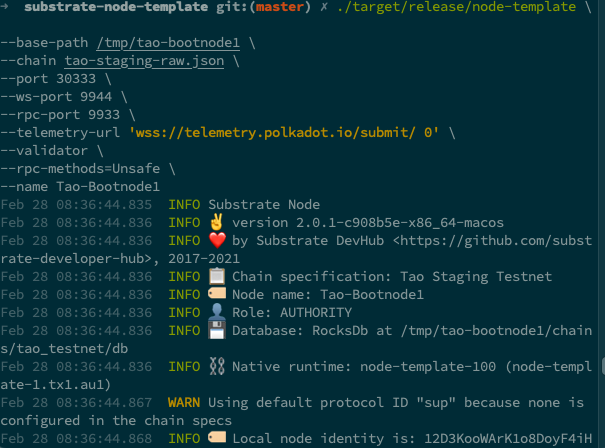

# Homework for lesson 12

build and run benchmark

```sh
1. cd node

2. cargo build --release --features runtime-benchmarks

3. cd ../

4. ./target/release/node-template benchmark --chain dev --execution=wasm --wasm-execution=compiled --pallet pallet_template --extrinsic do_something --steps 50 --repeat 20
```

1. 为 template 模块的 do_something 添加 benchmark 用例（也可以是其它自选模块的可调用函数），并且将 benchmark 运行的结果转换为对应的权重定义；

Note: 上传benchmark运行结果的命令行截图和最终的可调用函数代码片段（包含权重设置）。

- benchmark运行结果
  

- 转化为对应权重
  


2. 选择 node-template 或者其它节点程序，生成 Chain Spec 文件（两种格式都需要）；

Note: 上传 Chain Spec 文件即可

- Chain Spec
  [tao-staging.json](./substrate-node-template/tao-staging.json)

- Raw Chain Spec
  [tao-staging-raw.json](./substrate-node-template/tao-staging-raw.json)

3.（附加题）根据 Chain Spec，部署公开测试网络。

Note: 上传 telemetry.polkadot.io 上你的网络节点的截图，或者apps上staking页面截图。

- run bootnode1
  

- run validator1
  

- block imported and finalized
  

- telemetry
  
